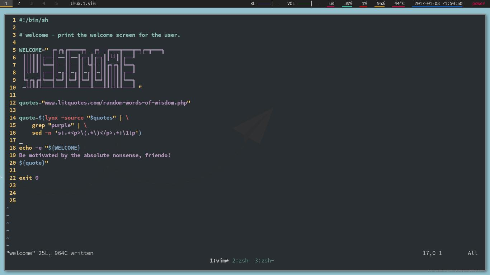
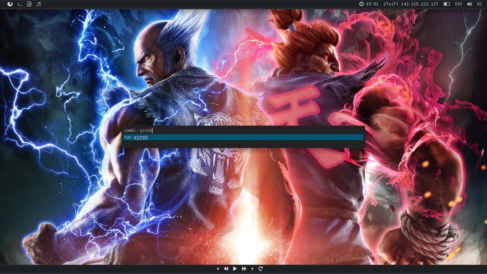

# dotfiles

My dotfiles.

### Current dotfiles history, explained by pictures:

*Still rocking Arch, a couple years from first encountering it.*

*Desktop with polybar config, improved. (11-16-2017)*

### **Fixes for Chromebook Acer C720 (4gb RAM, 30gb SSD), ArchLinux**

 * Sound:
  
    * alsa-base.conf (not 100% sure, forgot.) --> /etc/modprobe.d/
    
  * Touchpad:
  
    * Follow ArchWiki instructions on touchpad customization.
    
    * Install xf86-input-synaptics via pacman.
    
  * Edit the panel: [xft-lemonbar] (https://aur.archlinux.org/packages/lemonbar-xft-git/) and [dmenu2] (https://aur.archlinux.org/packages/dmenu2/), or for the lazy [polybar] (https://github.com/jaagr/polybar)
    
  * weechat (irc)

  * How to fix network issues if it's during install on uni wifi:
      
      1. Create a wpa config file, something like example.conf:
         ~~~~~~~~~~~~~~~~~~~~~~~~~~~~~~~~~~~~~~
         ctrl_interface=/var/run/wpa_supplicant
         network={
             ssid="ssidname"
              key_mgmt=WPA-EAP
              eap=PEAP
              identity="user@domain"
              password="password" 
          }
          ~~~~~~~~~~~~~~~~~~~~~~~~~~~~~~~~~~~~~
          
      2. Connect with `wpa-supplicant -B -i interface -c example.conf`.
      
      3. Get an ip address with dhcpcd, i.e `dhcpcd interface`.
      
      4. Profit!
    
    

